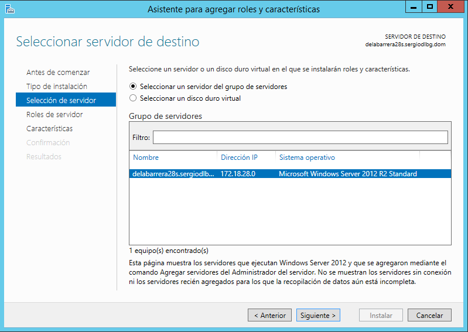
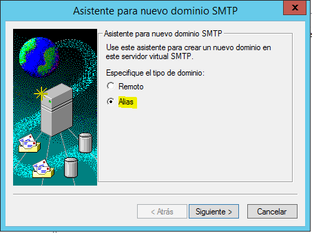
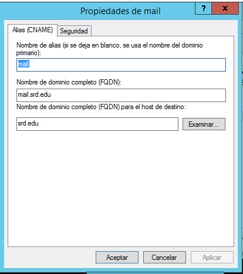
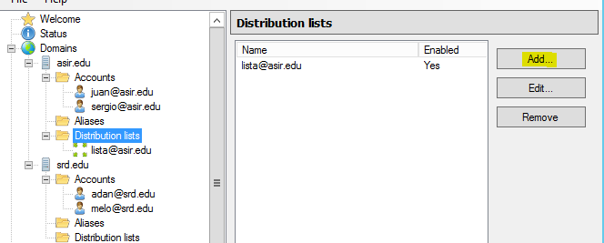

# Práctica Servicio SMTP Windows 2012 Server

* Instalar Servicio SMTP en Windows 2012 Server

* Configuración de servicio SMTP a través del administrador de aplicaciones (IIS) 6.0. Realizar las siguientes acciones de configuración:

* Establecer como IP nuestro servidor

* Limitar el número de conexiones a 50

* Habilitar el registro en formato W3C, diario y en una carpeta determinada

* Configurar envío de mensajes dentro de nuestra red local: Aceptar la conexión al servidor y la retransmisión de mensajes a todos los equipos menos los que aparecen en la lista (incluir una IP cualquiera en la lista para impedir su acceso y retransmisión)

* Establecer autenticación anónima

* Echar un vistazo al resto de opciones de configuración del servidor. Aplicar cambios y reiniciar servicio.

* Comprobar la existencia del dominio AD predeterminado. Crea un dominio de tipo alias para disponer de cuentas en otro dominio.

* Comprueba carpetas de correo creados en `C:\Inetpub\mailroot`.

En el cliente Windows:
* Comprobar acceso al nuevo nombre DNS creado en el servidor.(No se pudo acceder tras varios intentos, por lo que opté por poner la IP directamente (**Comprobastes que estaba todo bien configurado, simplemente no funcionaba** )

* Configurar el cliente de correo Live mail agregando dos cuentas de correo cualesquiera (usuarios AD -dominio- y no AD). Se deberá especificar: usuario / buzón, contraseña,  servidor SMTP.

* Enviar varios correos desde / hacia las diferentes cuentas y comprobar envío (real o ficticio) y carpetas mailroot. Las carpetas existentes en mailroot alojan mensajes en cola (Queue), mensajes para destinatarios desconocidos (Badmail) y mensajes entregados (Drop)

> Comprobación en carpeta Badmail de correo inexistente.

* Nueva configuración de servicio SMTP a través del administrador de aplicaciones (IIS) 6.0. Establecer autenticación básica de Windows. Probar diferentes configuraciones de dominio predeterminado, cifrado TLS, etc.

> Creamos un usuario de Active Directory destinado a comprobar la autenticación

En el cliente Windows:
* Configurar las cuentas según los parámetros especificados en el servidor. Enviar varios correos desde / hacia las diferentes cuentas y comprobar envío y carpetas mailroot. En este caso sólo tendrán acceso al servidor SMTP cuentas del dominio y correspondientes a usuarios de AD.

> Prueba para enviar un correo desde la cuenta creada hasta mi cuenta de correo personal.

> Ahora activamos la opción de certificado TLS.

> Configuramos la cuenta de correo ya creada con la opción para TLS.

> Prueba para enviar un correo desde la cuenta creada hasta mi cuenta de correo personal.

# Práctica hMailServer

* En primer lugar, hay que desinstalar el servicio SMTP de Windows 2012 Server.

> Reiniciamos el servidor

* Debes descargar e instalar en el servidor Windows 2012 server el servidor de correo hMailServer.

> Es necesario instalar en .NET Framework 3.5

* Crea dos dominios denominados srd.edu y asir.edu.

> Nos conectamos en localhost introduciendo la password que dimos al instalarlo.

* Ejecuta los diagnósticos para ambos dominios y soluciona el error de backup asignando una carpeta para tal fin. Establece copia de seguridad de los mensajes.

* Crea dos cuentas para dos usuarios ficticios en cada uno de los dos dominios. Investiga y configura las cuentas con diferentes opciones (cuota de disco, auto-reply, forwarding, signature, etc.)

* Configura el servicio DNS para crear las entradas mail.srd.edu y mail.asir.edu que apunten a la dirección ip del servidor windows 2012.

* Realiza todas las opciones de configuración que consideres necesarias y/o convenientes.Consulta para ello los tutoriales cuyos enlaces se proporcionan (opciones de protocolos SMTP, POP e IMAP, rangos de IP, bloqueo de correo entrante, nombre de host, reenvío dominios remotos, blacklists, opciones de logging, etc.)

* Configura en el cliente W7 un cliente de correo como thunderbird o Live Mail (en los ordenadores clientes) para acceder al servidor de correo instalado en Windows 2012.

* Realiza prueba de envío y recepción de correos entre los diferentes usuarios, comprobando, además de envío y recepción correctas, el efecto de las opciones configuradas en las cuentas.

> No me dejaba enviar un correo a mi cuenta personal de gmail (**mirastes las configuraciones y estaban bien**)

* Crea una lista de distribución empleados asociada al dominio y añade a los dos usuarios de miempresa.com a ella.

* Realiza prueba de envío y recepción de correos por medio de la lista de distribución.

