# Trabajo en grupo DHCP Failover en Windows 2012 Server

> Trabajo realizado por Sergio de la Barrera García y Adán Pérez García

##1. Preparación de las máquinas

En esta práctica utilizaremos dos máquinas Windows 2012 Server (Utilizamos una que ya tenemos y creamos otra nueva) y una máquina Windows 10.

>Cabe destacar que todas las máquinas están en red interna.

##2.1 Configurar Máquina DHCP1

 Primero vamos a la máquina Windows 2012 server que ya teníamos creada puesto que cuenta con *Active Directory*,*DHCP* y *DNS* los cuales son servicios necesarios para esta actividad.

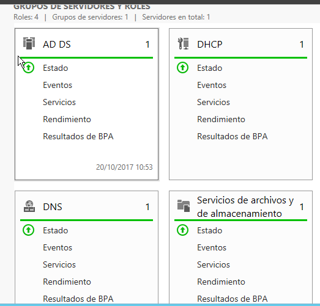

 Lo único que hay que hacer es eliminar el superámbito que ya tenía creado.

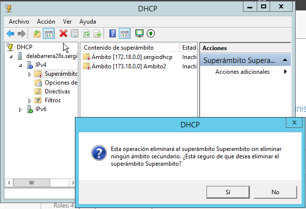

* Después creamos un ámbito nuevo llamado Failover.

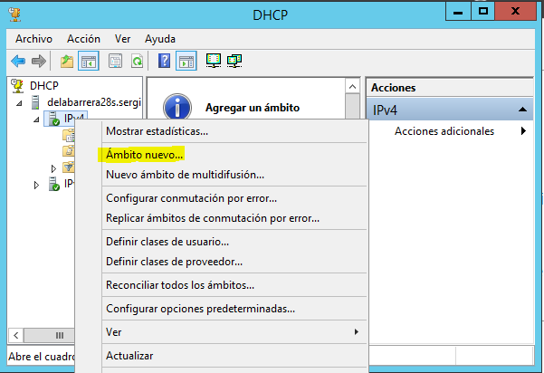

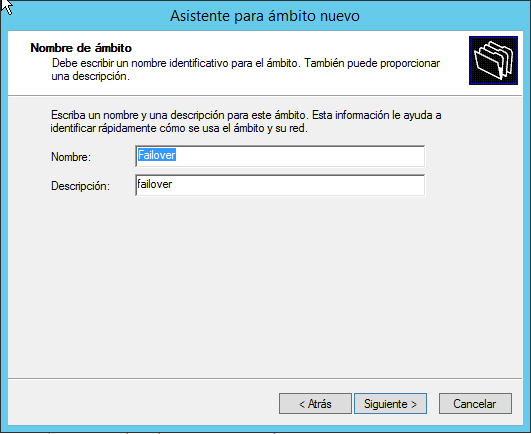

* Este va a contar con un rango de ips para distribuir desde la `172.18.28.10` hasta la `172.18.28.50`.

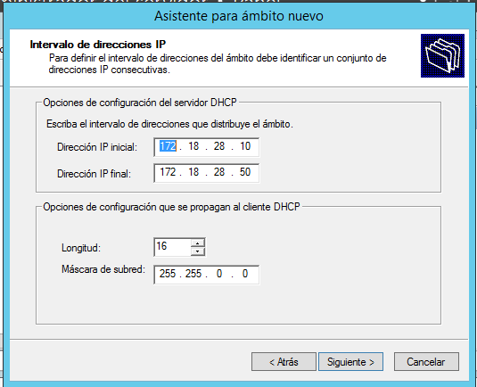

* Posteriormente indicamos que este ámbito va a estar en nuestro dominio y servidor.

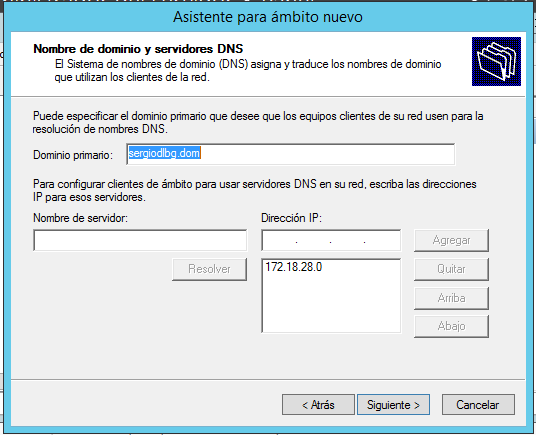

##2.2 Configurar Máquina DHCP2

Esta máquina la creamos desde cero para evitar problemas con nombres, dominios,etc...

Una vez la tenemos instalada lo primero que debemos hacer es poner la tarjeta de red en interna al igual que la DHCP1.

Seguidamente la iniciamos y le ponemos como servidor DNS la ip de la máquina DHCP1 ya que esta cuenta con un servicio DNS propio.

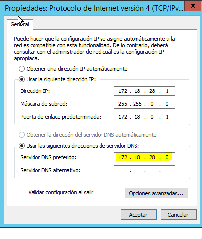

A continuación unimos la máquina al dominio de la máquina DHCP1.

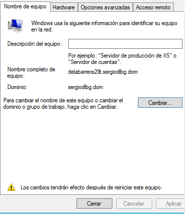

Después de haber reiniciado vamos a *Agregar roles y características*, seleccionamos **Servidor DHCP** y lo instalamos.

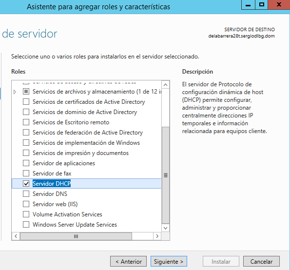

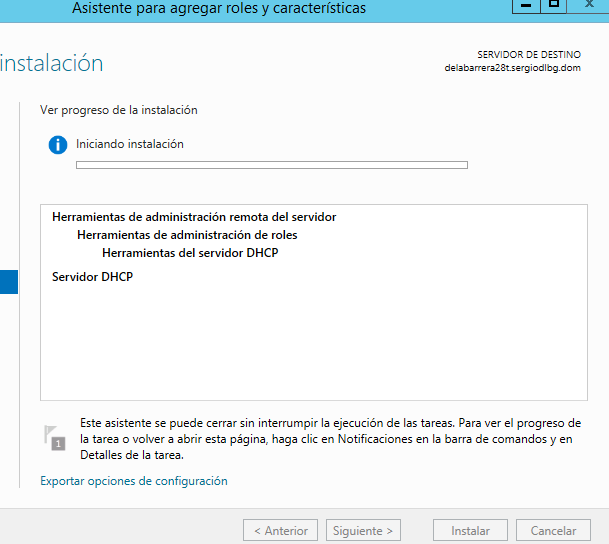

Una vez instalado ya solo queda configurar el Failover.

##3. Configurar DHCP Failover

Ahora nos situamos en la máquina DHCP1. Exactamente en *Herramientas -> DHCP*. Clickamos con botón derecho sobre el ámbito que creamos anteriormente y seleccionamos *Configurar conmutación por error...*.

 * Después de seleccionar nuestro ámbito, configuramos el Failover de la siguiente manera:

 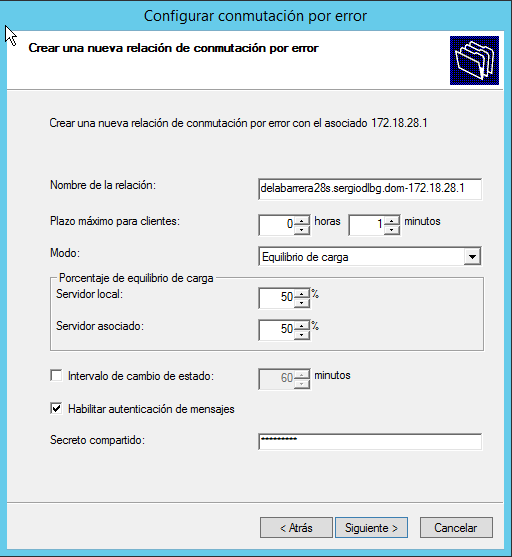

* Una vez configurado le damos a siguiente y esperamos a que se termine de cargar la configuración.

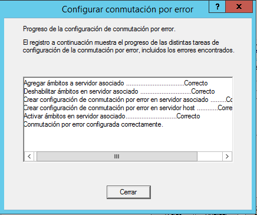

Finalmente ya podemos ver que tenemos el ámbito del DHCP1 en el DHCP2.

##4. Comprobaciones

Ya solo queda comprobar el Failover en el cliente.Para ello utilizaremos la máquina Windows 10.La cual esta en la misma red interna que las demás.

* Iniciamos sesión en ella, abrimos una consola y ponemos `ipconfig /renew` para que nos de una ip dentro del rango que pusimos anteriormente.

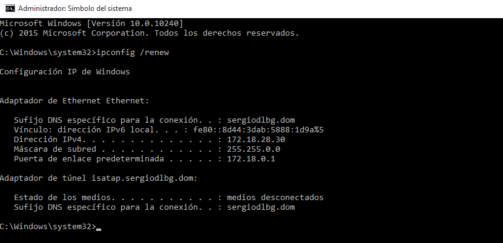

* Después desconectamos de la red una de las máquinas DHCP.(De esta forma nos aseguramos de que los dos DHCP funcionan por igual)

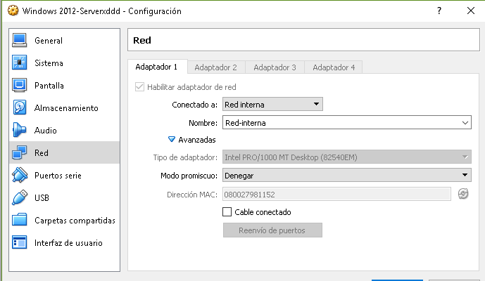

* Volvemos a probar en el cliente.

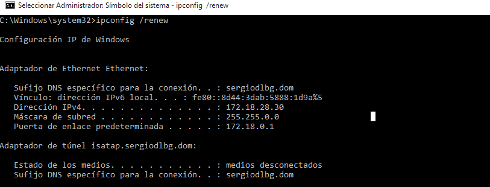

Y como podemos ver nos da la ip dentro del rango asignado, ya esten los dos conectados (DHCP1 y DHCP2) o este desconectado uno.
