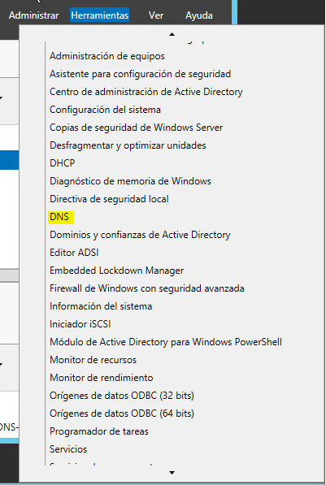

# Instalación y Configuración DNS W2012

## 1. Máquinas necesarias

Para esta práctica necesitaremos una máquina Windows 2012 Server y otra máquina Cliente con Windows 10.

Ponemos la tarjeta de red del server y el cliente en modo puente. Además al server le ponemos la siguiente configuración de red:

En el cliente solo le ponemos como servidor dns la ip del servidor:

## 2. Configurar el servicio DNS

Para ello vamos al servidor y clickamos sobre `Herramientas -> DNS`.

Una vez hecho esto, se nos abre una ventana para administrar el DNS.

>En él se puede ver que ya hay una zona de búsqueda directa que esta asociado al dominio

## 3.1 Creación de zona de búsqueda directa

Ahora vamos a crear una nueva zona de búsqueda directa.Para ello clickamos con el botón derecho dentro de la zona de búsqueda directa y le damos a `crear nueva zona`.

A continuación se nos despliega el `asistente para nueva zona`.

Le damos a `siguiente` y seleccionamos el tipo de zona en nuestro caso `zona principal`.

Seguidamente le ponemos un nombre a la zona que queremos crear.

Ya solo queda especificar el tipo de actualizaciones que aceptará la zona DNS.

Después de haber hecho esto ya podemos comprobar que hemos creado una nueva zona.

## 3.2 Creación de zona de búsqueda inversa

Ahora vamos a crear una nueva zona de búsqueda inversa.Para ello clickamos con el botón derecho dentro de la zona de búsqueda inversa y le damos a `crear nueva zona`.

A continuación, al igual que en la directa, nos sale el `asistente para nueva zona`, en este caso inversa.Seleccionamos la opción para redes con *IPv4*.

Le damos a siguiente y escribimos una ip para identificar a la zona de búsqueda inversa.

Ya solo queda darle a finalizar y tenemos creado nuesta zona.

Podemos comprobarlo en la parte de zonas de búsqueda inversa.

## 4. Configurar los reenviadores

Clickamos con el botón derecho sobre el nombre de nuestro servidor y seleccionaos `Propiedades`.

 Una vez hecho esto vamos a la pestaña que pone `Reenviadores` dentro de las `Propiedades` de nuestro servidor.

 

 Y Clickamos en Editar, dentro de ahí ponemos las siguientes direcciones ip.

 

Depués de haber hecho esto nos vamos a la máquina Windows 10
cliente y comprobamos que los reenviadores estan bien configurados.

Para esto abrimos una `cmd` y hacemos un `nslookup` a cualquier dirección web conocida.

## 5. Añadiendo registros a zona de busqueda directa
> Para hacer esto clickamos con el botón derecho dentro de la zona y seleccionando el registro que queremos crear

Vamos a la zona de búsqueda y añadimos los siguientes registros:

 * Un alias para tu servidor denominado server.

    * Primero elegimos el nombre de alias que queremos poner .

    * Después debemos seleccionar de quien va a ser alias(nuestro servidor) y aceptamos.

 * Una impresora con IP fija denominada printer (no hace falta alias).
    * Simplemente hay que crear un host nuevo llamado *impresora*, le asignamos una ip cualquiera fija y le damos a `agregar host`.

  

 * Un servidor de correo (ficticio) denominado correo, asociado a una dirección en tu servidor.

    * Primero tenemos que crear un host nuevo llamado correo.
    * Después agregamos un registro llamado `Agente de intercambio de correo(MX)`. En él hay que especificar el host que creamos anteriormente y un nombre de dominio.

### 5.1 Comprobaciones tanto en el propio servidor como en el cliente.

>registros de servidor

>registro de impresora

>registros de correo

## 6. Creación de una subzona  

Vamos a la zonaservidor que creamos anteriormete y clickamos con el botón derecho sobre él y seleccionamos `dominio nuevo`.

 Le ponemos de nombre servicios

 

 Ahora dentro de la subzona añadimos los siguientes:

 * Un servidor ftp (asociado a la misma IP del servidor)
    * Simplemente creamos un host nuevo con la ip de servidor.

 * Una impresora nueva (con una IP fija)  
    * Creamos otro host con una ip fija.

 * Un equipo del administrador del sistema (también con IP fija)

    * Igual que antes creamos un host con una ip fija.

  
### 6.2 Comprobaciones

> registro de servidor

> registro de impresora2

> registro del equipo administrador

## 7. Unión al dominio y comprobacion de registro

### 7.1 Validamos un cliente en el dominio

Para ello hay que entrar en la máquina cliente y unirlo al dominio. Nos pide iniciar sesión.

 Después nos sale un mensaje de que se ha unido al dominio.

 

### 7.2 Comprobación del registro

Vamos al servidor y miramos la zona de búsqueda directa que ya teníamos creada (preteneciente al domino) y comprobamos que hay un registro de tipo *A* con el nombre del equipo.

## 8. Comprobación final en el cliente

Hacemos una última comprobación mediante lookup después de todos los cambios.

