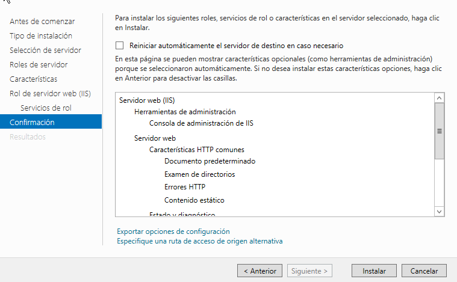
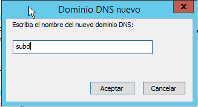
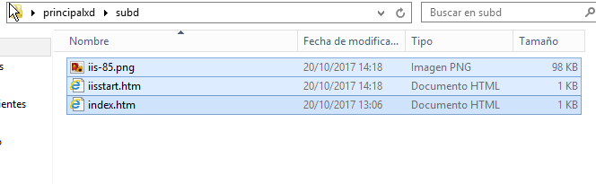

# Informe ISS- Servidor Web básico

En esta práctica utilizaremos una máquina Windows 2012 Server y otra máquina W10 cliente para comprobaciones.

## Instalación y configuración de ISS en Servidor

 * Para instalar ISS en nuestro servidor nos vamos a `Administrar -> Agregar roles y características`.

 

 * Seguidamente seleccionamos el rol de servidor con el nombre `Servidor web(IIS)`.

 

 * Agregamos las características necesarias para el Servidor web ISS.

 

 

 * A continuación seleccionamos la opción `Autenticación de Windows` en *Servicios de rol*.

 

 * Ya solo queda instalar.

 

 

 * Para comprobar que se nos ha instalado bien vamos a un navegador y ponemos nuestra ip de servidor.
> En el propio servidor

  

> En el cliente, ya que le pusimos como proovedor dns nuestro servidor. 

 

* Ahora aprovechamos una zona de busqueda directa que ya teníamos creada llamada *zona servidor* que apunta a nuestro servidor.

 

 * Para poder entrar a la zona servidor mediante `www.zonaservidor` tenemos que crear un alias dentro de la *zonaservidor*.

  

  * Comprobamos en el cliente que podemos acceder usando `www.`

   

* Después vamos a crear una página web HMTL sencilla para utilizarla como página principal de nuestro dominio.Para ello debemos poner el archivo `index.htm` en la ruta `C:\Inetpub\wwwroot`.

 

 > contenido del index

  

* Comprobamos que se nos muestra la página web  en nuestro dominio.

> servidor

 

> cliente

 

 * Ahora vamos a crear una carpeta dentro del la ruta fisica por defecto de ISS (`\Inetpub\wwroot`)

 

 * De esta manera nos mostraría el index que hay dentro de ella.

 

* Ahora comprobamos que nos muestre el index.

 

## Creación de sitios web independientes

* Para crear un sitio web independiente asociado a un dominio principal debemos crear una zona de búsqueda directa nueva.

> Click derecho sobre zona de búbusqueda directa y seleccionamos `Zona nueva`.
 

  

* Seleccionamos el tipo de zona, en nuestro caso principal.

 

 * Escogemos la opción siguiente de que se repliquen los datos DNS:

  

* Le ponemos como nombre `principalxd.com`.

 

* Ya solo nos queda darle a finalizar.

 

* Ahora creamos un Host dentro de la nueva zona con la dirección ip de nuestro servidor.

 

 * Además le ponemos un alias *www* para que se pueda acceder como `www.principalxd.com`.
 > obviamente el alias es sobre nuestra nueva zona
   

* Después de hacer esto nos vamos a `Herramientas -> Administrador de Internet Information Services `

* A continuación seleccionamos nuestro servidor u clickamos con botón derecho sobre `Sitios` y seleccionamos `Agregrar sitio web...`

* Y para que se cree correctamente debemos rellenarlo de la siguiente manera.
> Ponemos la ruta de una carpeta que creamos anteriormente.

* Dentro de la carpeta que creeamos en el escritorio ponemos un index.

* El contenido del `index.htm` es el siguiente.

* Además hay que darle permisos sobre la carpeta al usuario IUSR para que no de problemas.

* Comprobamos la página web en un navegador.
>server

>cliente

>además probamos el alias

* Ahora vamos a crear el subdominio. Para ello debemos crear un dominio dns nuevo llamado *subd* dentro de la zona directa nueva.

* Dentro de esta "subzona" añadimos un host que indica a la ip del propio servidor.

* Después de hacer esto tenemos que ir al `Administrador de Internet Information Services` y agregar un sitio web nuevo.

* Este tiene como ruta física una carpeta dentro de *principalxd* llamada *subd*.

* Dentro de subd tenemos que poner un `index.htm`.

* En este caso el `index.htm` es de la siguiente forma.

* Ahora comprobamos en el navegador.

> en el servidor

> en el cliente

## Creación de Directorios Virtuales

* Para crear un directorio virtual nos vamos al `Administrador de Internet Information Services` y clickamos con botón derecho sobre nuestro sitio web llamado *principal*.

* Este directorio virtual va a ser la carpeta que hemos creado llamada entornos.

* Dentro de la carpeta entorno ponemos las carpeta entorno1, entorno 2 y entorno 3, las cuales contienen un `index.htm` como el siguiente.

* Además de esto nos vamos a la seccion de  `Administrador de Internet Information Services` llamada `Examen de directorios`.

* Una vez ahí habilitamos esa opción.

* Comprobamos que se hizo correctamente.

>en el servidor

> en el cliente

* Después clickamos en cada enlace de los directorios para comprobar que funcionan.

