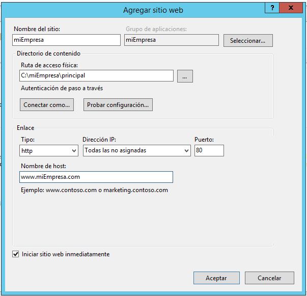
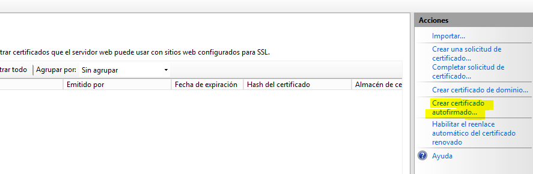
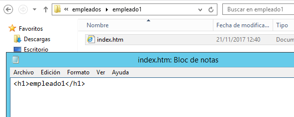
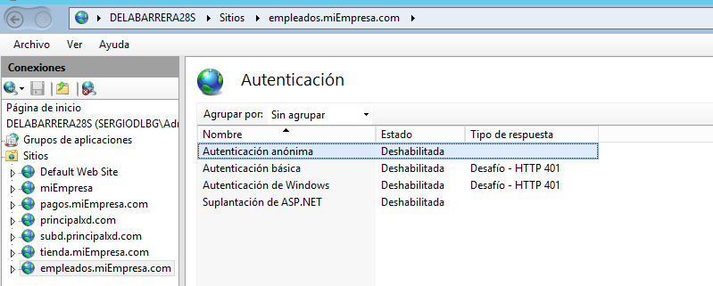
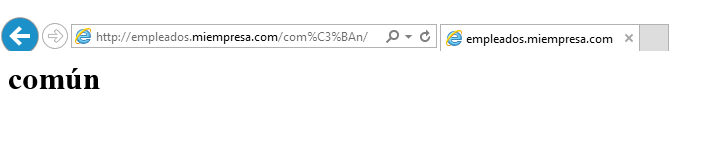

# Informe ISS- Servidor Web avanzado

* Crea una nueva zona de búsqueda directa en los servicios DNS asociado al dominio miEmpresa. Crea también una carpeta miEmpresa en C:\ y una subcarpeta ‘principal’.

* Crea un nuevo sitio web denominado miEmpresa en IIS asociado a la subcarpeta anterior y con acceso a través de la dirección www.miEmpresa.com. Actualiza DNS adecuadamente.

* Siguiendo los pasos detallados en el documento PDF de Carpetas Seguras y Privadas, crea un nuevo sitio web (denominado ‘pagos’) como subdominio de miEmpresa (pagos.miEmpresa.com) y configura este último para ser accedido de forma segura, vía ‘https’.
* Crea el sitio web, asociado a una carpeta (miEmpresa\pagos) y con la configuración adecuada en IIS y en los servicios DNS. Comprueba el acceso (aún vía ‘http’) con un navegador desde el propio servidor y desde un cliente W7.

* Configuración A: Siguiendo los pasos del tutorial correspondiente, configura el nuevo sitio para que se pueda acceder (sólo) como sitio web seguro (https) con un Certificado Autofirmado.

* Configuración B: Crearemos un nuevo sitio seguro (tienda.miempresa.com) con la generación de un Certificado Digital a través de la aplicación OpenSSL. Para empezar, realizaremos la solicitud de un nuevo certificado de servidor para nuestro sitio seguro (crear fichero certreq.txt).

* Descargar e instalar OpenSSL para Windows.

* A través de OpenSSl genera un nuevo certificado de servidor, siguiendo los pasos que se detallan en tutorial web (y comprobando los ficheros generados en cada paso): generar una clave privada de la entidad certificadora, crear un certificado digital de la entidad certificadora y, finalmente, crear un certificado digital de nuestra web.

* Importar el nuevo certificado de servidor creado para completar la petición pendiente en nuestro sitio seguro ‘pagos’.

* Requerir que nuestros sitio seguros sólo se pueda acceder mediante una conexión segura y reiniciar los sitios web.

* Finalmente, acceder mediante http y mediante https a los sitios seguros desde el propio servidor y desde un cliente W7, aceptando los posibles problemas con la entidad certificadora.

* Guiándote por los pasos detallados en el apartado de carpetas privadas del documento PDF de Carpetas Seguras y Privadas, vamos a crear un nuevo sitio web (empleados.miEmpresa.com) destinado a almacenar información privada de los empleados, con las siguientes características:

* Necesitamos crear una carpeta empleados (dentro de miEmpresa) y, dentro de esta, tres o cuatro subcarpetas personales con nombres de empleados y una, denominada común, a la que tendrán acceso todos los empleados, pero no otros usuarios sin identificar.

* Crearemos el nuevo sitio web, como subdominio de nuestro dominio principal, asociado a la carpeta genérica empleados.

* Colocar un fichero index.html diferente en cada una de las carpetas creadas, con el objetivo de poder comprobar el acceso desde un navegador.

* Para el sitio web creado y para cada una de sus carpetas, deshabilitamos el acceso anónimo.

* Agregar función de Autenticación Básica a nuestro Servicio de IIS a través de la Administración del Servidor.

* En Active Directory, crearemos un usuario para cada empleado (tantos como carpetas personales) y un grupo Empleados que los incluya a todos.

* Desactivamos, para la carpeta empleados, los permisos heredables a través de las opciones avanzadas en la ficha de seguridad. Añadimos grupo de Administradores con Control Total y grupo Empleados con Lectura y Ejecución+ Mostrar Carpeta+Leer.

* Realizamos el mismo procedimiento para cada una de las carpetas personales de los empleados, colocando como usuarios autorizados el Grupo de Administradores (Control Total) y el empleado propietario de cada carpeta (con los permisos que creas convenientes).

* Realizamos el mismo procedimiento para la carpeta ‘comun’, colocando como usuarios autorizados el Grupo de Administradores (Control Total) y el grupo Empleados (con los permisos que creas convenientes).

* Activamos Examen de directorios

* Comprobamos el acceso, tanto desde el servidor como desde el cliente W7, a las diferentes carpetas con distintos usuarios.

>en el servidor

>en el cliente

